## CSS简介


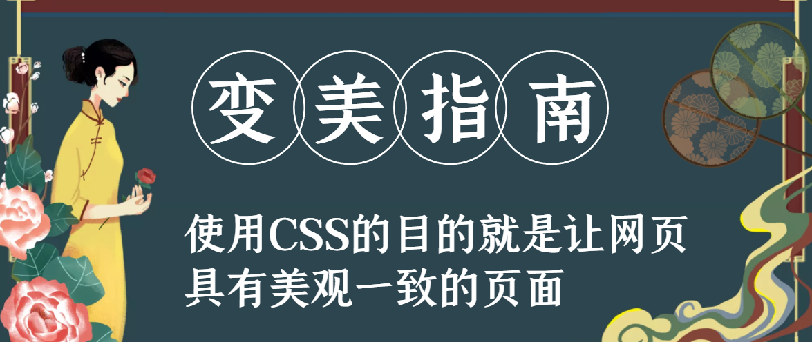


### CSS概念

CSS（Cascading Style Sheets）层叠样式表，又叫级联样式表，简称样式表

CSS文件后缀名为`.css`

CSS用于HTML文档中元素样式的定义


### 为什么需要CSS

使用css的唯一目的就是让网页具有美观一致的页面


### 语法

CSS 规则由两个主要的部分构成：选择器，以及一条或多条声明（样式）


选择器通常是您需要改变样式的 HTML 元素

每条声明由一个属性和一个值组成

属性（property）是您希望设置的样式属性（style attribute）。每个属性有一个值。属性和值被冒号分开

```css
<style>
    h1{
        color: blue;
        font-size: 12px;
    }
</style>
```


**实时效果反馈**

**1.下列关于CSS基础语法描述错误的是：**

<font style="background-color:rgb(233, 30, 100)">A</font>   CSS 规则由两个主要的部分构成：选择器，以及一条或多条声明

<font style="background-color:rgb(255, 197, 10)">B</font>   选择器通常是您需要改变样式的 HTML 元素

<font style="background-color:#8bc34a">C</font>   每条声明由一个属性和一个值组成

<font style="background-color:rgb(2, 170, 244);">D</font>   属性与属性值之间用分号隔开


**答案**

1=>D 


## CSS的引入方式


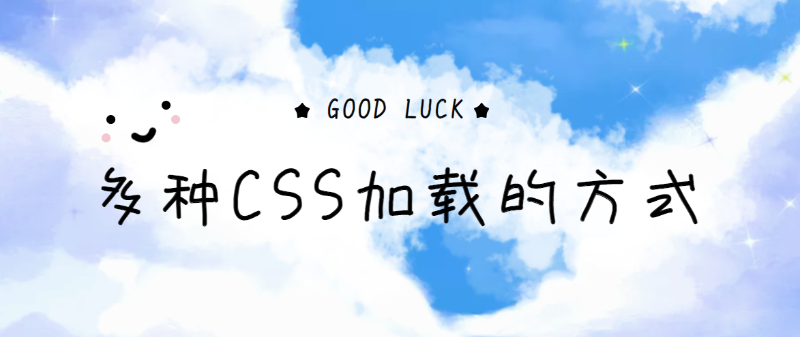


### 内联样式（行内样式）

要使用内联样式，你需要在相关的标签内使用样式（style）属性。Style 属性可以包含任何 CSS 属性

> **温馨提示**
>
> 缺乏整体性和规划性，不利于维护，维护成本高

```html
<p style="background: orange; font-size: 24px;">CSS<p>
```


### 内部样式

当单个文档需要特殊的样式时，就应该使用内部样式表。你可以使用 `<style>` 标签在文档头部定义内部样式表

> **温馨提示**
>
> 单个页面内的CSS代码具有统一性和规划性，便于维护，但是在多个页面之间容易混乱

```html
<head>
    <style> 
       h1 { 
           background: red; 
       } 
    </style>
</head>
```


### 外部样式（推荐）

当样式需要应用于很多页面时，外部样式表将是理想的选择。在使用外部样式表的情况下，你可以通过改变一个文件来改变整个站点的外观。每个页面使用 `<link>` 标签链接到样式表。 `<link>` 标签在（文档的）头部

```html
<link rel="stylesheet" type="text/css" href="xxx.css">
```


**实时效果反馈**

**1.外部CSS样式的引入方式，以下正确的是：**

<font style="background-color:rgb(233, 30, 100)">A</font>   `<style></style>`

<font style="background-color:rgb(255, 197, 10)">B</font>   `<link rel="stylesheet" href="xxx.css">`

<font style="background-color:#8bc34a">C</font>   `<p style="background: orange; font-size: 24px;">CSS<p>`


**答案**

1=>B 


## 选择器一


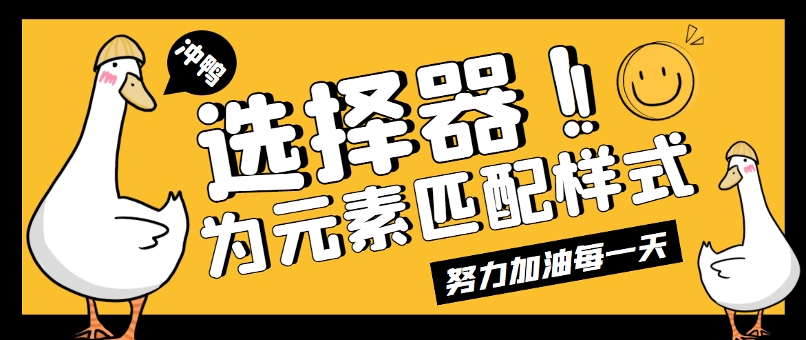


CSS语法 规则由两个主要的部分构成：**选择器**，以及一条或多条声明（样式）


### 全局选择器

可以与任何元素匹配，优先级最低，一般做样式初始化

```css
*{
     margin: 0;
     padding: 0;
 }
```


### 元素选择器

HTML文档中的元素，`p、b、div、a、img、body`等。

标签选择器，选择的是页面上所有这种类型的标签，所以经常描述“共性”，无法描述某一个元素的“个性”

```css
p{
    font-size:14px;
}
```

再比如说，我想让“学完前端，继续学Java”这句话中的“前端”两个变为红色字体，那么我可以用`<span>`标签把“前端”这两个字围起来，然后给`<span>`标签加一个标签选择器

```html
<p>学完了<span>前端</span>，继续学Java</p>
span{
	color: red;
}
```

> **温馨提示**
>
> 1. 所有的标签，都可以是选择器。比如ul、li、label、dt、dl、input、div等
> 2. 无论这个标签藏的多深，一定能够被选择上
> 3. 选择的所有，而不是一个


### 类选择器

规定用圆点 `.` 来定义，针对你想要的所有标签使用

> **优点**
>
> 灵活

```html
<h2 class="oneclass">你好</h2>
/*定义类选择器*/
.oneclass{
	width:800px;
}
```

> **class属性的特点**
>
> 1. 类选择器可以被多种标签使用
> 2. 类名不能以数字开头
> 3. 同一个标签可以使用多个类选择器。用空格隔开

```html
<h3 class="classone  classtwo">我是一个h3啊</h3>
```

```html
<h3 class="teshu" class="zhongyao">我是一个h3啊</h3>  // 错误
```


**实时效果反馈**

**1.下列代码哪个是类选择器使用方式：**

<font style="background-color:rgb(233, 30, 100)">A</font>   `h1{color:red;}`

<font style="background-color:rgb(255, 197, 10)">B</font>   `*{margin:0;}`

<font style="background-color:#8bc34a">C</font>   `.title{color:red;}`

<font style="background-color:rgb(2, 170, 244);">D</font>   `h3{color:red;}`


**答案**

1=>C 


## 选择器二


### ID选择器

针对某一个特定的标签来使用，只能使用一次。`css`中的`ID选择器`以 `#` 来定义

```html
<h2 id="mytitle">你好</h2>
#mytitle{
    border:3px dashed green;
}
```

> **特别强调**
>
> 1. ID是唯一的
> 2. ID不能以数字开头


### 合并选择器

语法：`选择器1,选择器2,...{ }`

作用：提取共同的样式，减少重复代码

```css
.header, .footer{
    height:300px;
}
```


### 选择器的优先级

CSS中,权重用数字衡量

元素选择器的权重为: 1

class选择器的权重为: 10

id选择器的权重为: 100

内联样式的权重为: 1000

优先级从高到低: 行内样式 > ID选择器 > 类选择器 > 元素选择器


**实时效果反馈**

**1.下列选择器优先级排序正确的是：**

<font style="background-color:rgb(233, 30, 100)">A</font>   行内样式 > ID选择器 > 类选择器 > 元素选择器

<font style="background-color:rgb(255, 197, 10)">B</font>   行内样式 > 类选择器 > ID选择器 > 元素选择器

<font style="background-color:#8bc34a">C</font>   行内样式 > 元素选择器 > 类选择器 > ID选择器

<font style="background-color:rgb(2, 170, 244);">D</font>   元素选择器 > ID选择器 > 类选择器 > 行内样式


**答案**

1=>A 


## 字体属性


CSS字体属性定义字体，颜色、大小，加粗，文字样式


### color

规定文本的颜色

```css
div{ color:red;}
div{ color:#ff0000;}
div{ color:rgb(255,0,0);}
div{ color:rgba(255,0,0,.5);}
```


### font-size

设置文本的大小

能否管理文字的大小，在网页设计中是非常重要的。但是，你不能通过调整字体大小使段落看上去像标题，或者使标题看上去像段落。

```css
h1 {font-size:40px;}
h2 {font-size:30px;}
p {font-size:14px;}
```

> **温馨提示**
>
> chrome浏览器接受最小字体是12px


### font-weight

设置文本的粗细

| 值      | 描述                                       |
| ------- | ------------------------------------------ |
| bold    | 定义粗体字符                               |
| bolder  | 定义更粗的字符                             |
| lighter | 定义更细的字符                             |
| 100~900 | 定义由细到粗  400等同默认，而700等同于bold |

```css
H1 {font-weight:normal;}
div{font-weight:bold;}
p{font-weight:900;}
```


### font-style

指定文本的字体样式

| 值     | 描述       |
| ------ | ---------- |
| normal | 默认值     |
| italic | 定义斜体字 |


### font-family

font-family属性指定一个元素的字体

> **温馨提示**
>
> 每个值用逗号分开
>
> 如果字体名称包含空格，它必须加上引号

```css
font-family:"Microsoft YaHei","Simsun","SimHei";
```


**实时效果反馈**

**1.下列哪个属性可以设置字体粗细：**

<font style="background-color:rgb(233, 30, 100)">A</font>   font-family

<font style="background-color:rgb(255, 197, 10)">B</font>   font-style

<font style="background-color:#8bc34a">C</font>   font-weight

<font style="background-color:rgb(2, 170, 244);">D</font>   font-size


**答案**

1=>C


## 背景属性


CSS背景属性主要有以下几个

| 属性                | 描述                 |
| ------------------- | -------------------- |
| background-color    | 设置背景颜色         |
| background-image    | 设置背景图片         |
| background-position | 设置背景图片显示位置 |
| background-repeat   | 设置背景图片如何填充 |
| background-size     | 设置背景图片大小属性 |


### background-color属性

该属性设置背景颜色

```css
<div class="box"></div>
.box{
    width: 300px;
    height: 300px;
    background-color: palevioletred;
}
```


### background-image属性

设置元素的背景图像

元素的背景是元素的总大小，包括填充和边界（不包括外边距）。默认情况下background-image属性放置在元素的左上角，如果图像不够大的话会在垂直和水平方向平铺图像，如果图像大小超过元素大小从图像的左上角显示元素大小的那部分

```css
<div class="box"></div>
.box{
    width: 600px;
    height: 600px;
    background-image: url("images/img1.jpg");
}
```


### background-repeat属性

该属性设置如何平铺背景图像

| 值        | 说明             |
| --------- | ---------------- |
| repeat    | 默认值           |
| repeat-x  | 只向水平方向平铺 |
| repeat-y  | 只向垂直方向平铺 |
| no-repeat | 不平铺           |

```css
.box{
    width: 600px;
    height: 600px;
    background-color: #fcc;
    background-image: url("images/img1.jpg");
    background-repeat: no-repeat;
}
```


### background-size属性

该属性设置背景图像的大小

| 值         | 说明                                                         |
| ---------- | ------------------------------------------------------------ |
| length     | 设置背景图片的宽度和高度，第一个值宽度，第二个值高度，如果只是设置一个，第二个值auto |
| percentage | 计算相对位置区域的百分比，第一个值宽度，第二个值高度，如果只是设置一个，第二个值auto |
| cover      | 保持图片纵横比并将图片缩放成完全覆盖背景区域的最小大小       |
| contain    | 保持图片纵横比并将图像缩放成适合背景定位区域的最大大小       |

```css
.box{
    width: 600px;
    height: 600px;
    background-image: url("images/img1.jpg");
    background-repeat: no-repeat;
    background-size: 100% 100%;
}
```


### background-position属性

该属性设置背景图像的起始位置，其默认值是：0% 0%

| 值            | 说明                                                         |
| ------------- | ------------------------------------------------------------ |
| left  top     | 左上角                                                       |
| left center   | 左 中                                                        |
| left bottom   | 左 下                                                        |
| right top     | 右上角                                                       |
| right center  | 右 中                                                        |
| right bottom  | 右 下                                                        |
| center top    | 中 上                                                        |
| center center | 中 中                                                        |
| center bottom | 中 下                                                        |
| x%  y%        | 第一个值是水平位置，第二个值是垂直位置，左上角是0%  0%，右下角是100%  100% 。如果只指定了一个值，其他值默认是50%。默认是0%  0% |
| xpos ypos     | 单位是像素                                                   |

```css
.box{
    width: 600px;
    height: 600px;
    background-color: #fcc;
    background-image: url("images/img1.jpg");
    background-repeat: no-repeat;
    background-position: center;
}
```


**实时效果反馈**

**1.下列哪个属性可以设置背景图片位置的调整：**

<font style="background-color:rgb(233, 30, 100)">A</font>   background-position

<font style="background-color:rgb(255, 197, 10)">B</font>   background-repeat

<font style="background-color:#8bc34a">C</font>   background-attachment

<font style="background-color:rgb(2, 170, 244);">D</font>   background-size


**2.下列关于`background-repeat`属性描述错误的是：**

<font style="background-color:rgb(233, 30, 100)">A</font>   repeat-x只向水平方向平铺

<font style="background-color:rgb(255, 197, 10)">B</font>   repeat-y只向垂直方向平铺

<font style="background-color:#8bc34a">C</font>   no-repeat不平铺

<font style="background-color:rgb(2, 170, 244);">D</font>   repeat默认不平铺


**答案**

1=>A   2=>D


## 文本属性


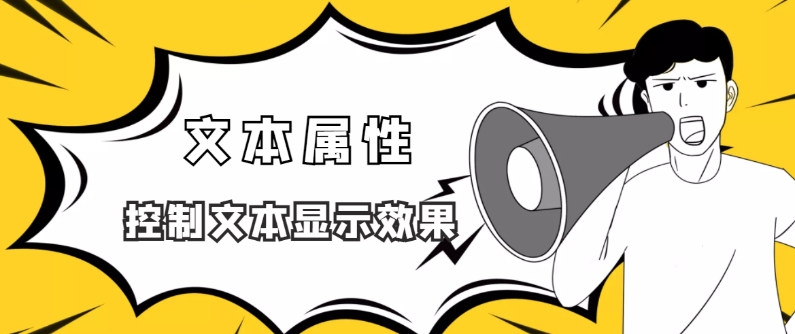


### text-align

指定元素文本的水平对齐方式

| 值     | 描述                 |
| ------ | -------------------- |
| left   | 文本居左排列，默认值 |
| right  | 把文本排列到右边     |
| center | 把文本排列到中间     |

```css
h1 {text-align:center}
h2 {text-align:left}
h3 {text-align:right}
```


### text-decoration

text-decoration 属性规定添加到文本的修饰，下划线、上划线、删除线等

| 值           | 描述       |
| ------------ | ---------- |
| underline    | 定义下划线 |
| overline     | 定义上划线 |
| line-through | 定义删除线 |

```css
h1 {text-decoration:overline} 
h2 {text-decoration:line-through} 
h3 {text-decoration:underline}
```


### text-transform

text-transform 属性控制文本的大小写

| 值         | 描述                 |
| ---------- | -------------------- |
| captialize | 定义每个单词开头大写 |
| uppercase  | 定义全部大写字母     |
| lowercase  | 定义全部小写字母     |

```css
h1 {text-transform:uppercase;}
h2 {text-transform:capitalize;}
p {text-transform:lowercase;}
```


### text-indent

text-indent 属性规定文本块中首行文本的缩进

```css
p{
	text-indent:50px;
}
```

> **温馨提示**
>
> 负值是允许的。如果值是负数，将第一行左缩进


**实时效果反馈**

**1.下列哪个属性可以设置文本首字母大写：**

<font style="background-color:rgb(233, 30, 100)">A</font>   text-indent

<font style="background-color:rgb(255, 197, 10)">B</font>   text-transform

<font style="background-color:#8bc34a">C</font>   text-decoration

<font style="background-color:rgb(2, 170, 244);">D</font>   text-align


**答案**

1=>B


## 表格属性


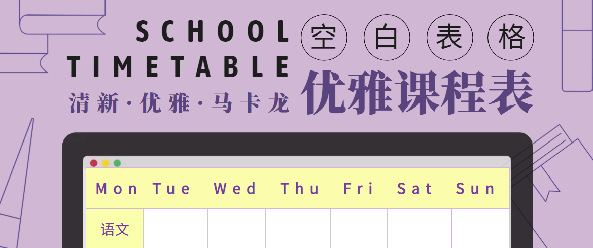


使用 CSS 可以使 HTML 表格更美观


### 表格边框

指定CSS表格边框，使用border属性

```css
table, td { 
    border: 1px solid black; 
}
```


### 折叠边框

border-collapse 属性设置表格的边框是否被折叠成一个单一的边框或隔开

```css
table { border-collapse:collapse; }
table,td { border: 1px solid black; }
```


### 表格宽度和高度

width和height属性定义表格的宽度和高度

```css
table { width:100%; } 
td { height:50px; }
```


### 表格文字对齐

表格中的文本对齐和垂直对齐属性

text-align属性设置水平对齐方式，向左，右，或中心

```css
td { text-align:right; }
```

垂直对齐属性设置垂直对齐

```css
td { height:50px; vertical-align:bottom; }
```


### 表格填充

如果在表的内容中控制空格之间的边框，应使用td和th元素的填充属性

```css
td { padding:15px; }
```


### 表格颜色

下面的例子指定边框的颜色，和th元素的文本和背景颜色

```css
table, td, th { border:1px solid green; } 
td { background-color:green; color:white; }
```


**实时效果反馈**

**1.下列哪个属性可以设置表格边框折叠：**

<font style="background-color:rgb(233, 30, 100)">A</font>   text-align

<font style="background-color:rgb(255, 197, 10)">B</font>   border-collapse

<font style="background-color:#8bc34a">C</font>   border

<font style="background-color:rgb(2, 170, 244);">D</font>   padding


**答案**

1=>B


## 关系选择器


**关系选择器分类**

1. 后代选择器
2. 子代选择器
3. 相邻兄弟选择器
4. 通用兄弟选择器


### 后代选择器

**定义**

选择所有被E元素包含的F元素，中间用空格隔开

**语法**

```css
E F{}
```

```html
<ul>
     <li>宝马</li>
     <li>奔驰</li>
</ul>
 <ol>
     <li>奥迪</li>
</ol>
```

```css
ul li{
    color:green;
}
```


### 子代选择器

**定义**

选择所有作为E元素的直接子元素F，对更深一层的元素不起作用，用>表示

**语法**

```css
E>F{}
```

```html
<div> 
    <a href="#">子元素1</a>
    <p> <a href="#">孙元素</a> </p>
    <a href="#">子元素2</a>
</div>
```

```css
div>a{
    color:red
}
```


### 相邻兄弟选择器

**定义**

选择紧跟E元素后的F元素，用加号表示，选择相邻的第一个兄弟元素，只能向下选择

**语法**

```css
E+F{}
```

```html
<h1>h1元素</h1> 
<p>第一个元素</p> 
<p>第二个元素</p>
```

```css
h1+p{
    color:red;
}
```


### 通用兄弟选择器

**定义**

选择E元素之后的所有兄弟元素F，作用于多个元素，用~隔开，只能向下选择

**语法**

```css
E~F{}
```

```html
<h1>h1元素</h1>
<p>第一个元素</p>
<p>第二个元素</p>
```

```css
h1~p{
    color:red;
}
```


**实时效果反馈**

**1.下列代码属于哪种关系选择器：**

```css
ul li{
    color:green;
}
```

<font style="background-color:rgb(233, 30, 100)">A</font>   后代选择器

<font style="background-color:rgb(255, 197, 10)">B</font>   子代选择器

<font style="background-color:#8bc34a">C</font>   相邻兄弟选择器

<font style="background-color:rgb(2, 170, 244);">D</font>   通用兄弟选择器


**答案**

1=>A


## CSS 盒子模型(Box Model)


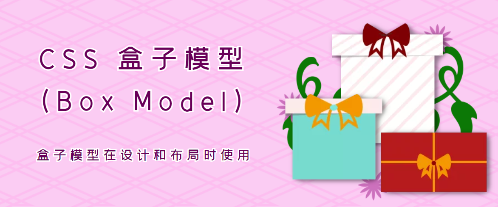


### 概念

所有HTML元素可以看作盒子，在CSS中，"box model"这一术语是用来设计和布局时使用

CSS盒模型本质上是一个盒子，封装周围的HTML元素，它包括：

外边距（margin），边框（border），内边距（padding），和实际内容（content）


1. Margin(外边距) - 清除边框外的区域，外边距是透明的（两个值：第一个值上下，第二个值左右）
2. Border(边框) - 围绕在内边距和内容外的边框
3. Padding(内边距) - 清除内容周围的区域（两个值：第一个值上下，第二个值左右）
4. Content(内容) - 盒子的内容，显示文本和图像


如果把盒子模型看作是一个生活中的快递，那么内容部分等同于你买的实物，内边距等同于快递盒子中的泡沫，边框等同于快递盒子，外边距等同于两个快递盒子之间的距离


```html
<div></div>
```

```css
div{
    width: 100px;
    height: 100px;
    padding: 10px;
    border: 2px solid red;
    margin: 10px;
    background: green;
}
```


**实时效果反馈**

**1.下列盒子模型元素描述正确的是：**

<font style="background-color:rgb(233, 30, 100)">A</font>   外边距（margin）,边框（border）,内边距（padding）,和实际内容（content）

<font style="background-color:rgb(255, 197, 10)">B</font>   外边距（margin）,边框（border）,大小（font-size）,和实际内容（content）

<font style="background-color:#8bc34a">C</font>   外边距（margin）,背景（background）,内边距（padding）,和实际内容（content）

<font style="background-color:rgb(2, 170, 244);">D</font>   颜色（color）,边框（border）,内边距（padding）,和实际内容（content）


**答案**

1=>A


## 弹性盒模型（flex box）


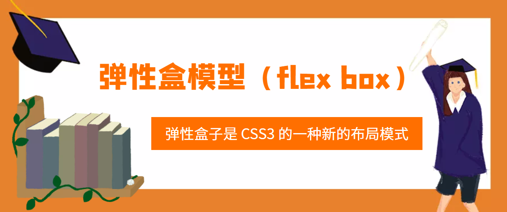


### **定义**

弹性盒子是 CSS3 的一种新的布局模式

CSS3 弹性盒是一种当页面需要适应不同的屏幕大小以及设备类型时确保元素拥有恰当的行为的布局方式

引入弹性盒布局模型的目的是提供一种更加有效的方式来对一个容器中的子元素进行排列、对齐和分配空白空间


### CSS3弹性盒内容

弹性盒子由弹性容器(Flex container)和弹性子元素(Flex item)组成

弹性容器通过设置 `display `属性的值为 `flex `将其定义为弹性容器

弹性容器内包含了一个或多个弹性子元素

> **温馨提示**
>
> 弹性容器外及弹性子元素内是正常渲染的。弹性盒子只定义了弹性子元素如何在弹性容器内布局

```html
<div class="flex-container">
    <div class="flex-item">flex item 1</div>
    <div class="flex-item">flex item 2</div>
    <div class="flex-item">flex item 3</div> 
</div>
<style>
    .flex-container {
        display: flex;
        width: 400px;
        height: 250px;
        background-color: lightgrey;
    }
    .flex-item {
        background-color: cornflowerblue;
        width: 100px;
        height: 100px;
        margin: 10px;
    }
</style>
```


> **温馨提示**
>
> 默认弹性盒里内容横向摆放


### 父元素上的属性


#### **display 属性**

`display:flex;`开启弹性盒

`display:flex;`属性设置后子元素默认水平排列


#### **flex-direction属性**

**定义**

flex-direction 属性指定了弹性子元素在父容器中的位置

**语法**

```css
flex-direction: row | row-reverse | column | column-reverse
```

1. row：横向从左到右排列（左对齐），默认的排列方式

2. row-reverse：反转横向排列（右对齐，从后往前排，最后一项排在最前面

3. column：纵向排列

4. column-reverse：反转纵向排列，从后往前排，最后一项排在最上面

   

```css
.flex-container {
    display: flex;
    flex-direction: column;
    width: 400px;
    height: 250px;
    background-color: lightgrey;
}
```


#### justify-content 属性

**定义**

内容对齐（justify-content）属性应用在弹性容器上，把弹性项沿着弹性容器的主轴线（main axis）对齐

**语法**

```css
justify-content: flex-start | flex-end | center 
```

1. `flex-start` 弹性项目向行头紧挨着填充。这个是默认值。第一个弹性项的main-start外边距边线被放置在该行的main-start边线，而后续弹性项依次平齐摆放
2. `flex-end` 弹性项目向行尾紧挨着填充。第一个弹性项的main-end外边距边线被放置在该行的main-end边线，而后续弹性项依次平齐摆放
3. `center` 弹性项目居中紧挨着填充。（如果剩余的自由空间是负的，则弹性项目将在两个方向上同时溢出）

```css
.flex-container {
    display: flex;
    justify-content: center;
    width: 400px;
    height: 250px;
    background-color: lightgrey;
}
```


#### align-items 属性

**定义**

`align-items` 设置或检索弹性盒子元素在侧轴（纵轴）方向上的对齐方式

**语法**

```css
align-items: flex-start | flex-end | center 
```

1. `flex-start` 弹性盒子元素的侧轴（纵轴）起始位置的边界紧靠住该行的侧轴起始边界
2. `flex-end` 弹性盒子元素的侧轴（纵轴）起始位置的边界紧靠住该行的侧轴结束边界
3. `center` 弹性盒子元素在该行的侧轴（纵轴）上居中放置。（如果该行的尺寸小于弹性盒子元素的尺寸，则会向两个方向溢出相同的长度）


### **子元素上的属性**


#### flex

`flex` 根据弹性盒子元素所设置的扩展因子作为比率来分配剩余空间

默认为0，即如果存在剩余空间，也不放大

如果只有一个子元素设置，那么按扩展因子转化的百分比对其分配剩余空间。0.1即10%，1即100%，超出按100%

```css
<div class="flex-container">
    <div class="flex-item1">flex item 1</div>
    <div class="flex-item2">flex item 2</div>
    <div class="flex-item3">flex item 3</div> 
</div>
<style>
	.flex-container {
        display: flex;
        width: 400px;
        height: 250px;
        background-color: gold;
    }
    .flex-item1 {
        height: 150px;
        background-color: red;
        flex: 1;
    }
    .flex-item2 {
        height: 150px;
        background-color: green;
        flex: 2;
    }
    .flex-item3 {
        height: 150px;
        background-color: blue;
        flex: 1;
    }
</style>
```


**实时效果反馈**

**1.在弹性盒子模型中，一个元素块上下左右居中如何实现：**

<font style="background-color:rgb(233, 30, 100)">A</font>   `{justify-content:center;align-items:center;}`

<font style="background-color:rgb(255, 197, 10)">B</font>   `{flex-direction:center;align-items:center;}`

<font style="background-color:#8bc34a">C</font>   `{justify-content:center;display:center;}`

<font style="background-color:rgb(2, 170, 244);">D</font>   `{justify-content:center;flex:center;}`


**答案**

1=>A


## 文档流


文档流是文档中可显示对象在排列时所占用的位置/空间

例如：块元素自上而下摆放，内联元素，从左到右摆放 

标准流里面的限制非常多，导致很多页面效果无法实现

1. 高矮不齐，底边对齐
2. 空白折叠现象
   1. 无论多少个空格、换行、tab，都会折叠为一个空格
   2. 如果我们想让img标签之间没有空隙，必须紧密连接


### 文档流产生的问题


#### 高矮不齐，底边对齐


```html
<span>我是文本内容</span>

```

```css
img{
    width: 200px;
}
```


#### 空格折叠


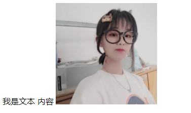

```html
<span>我是文本       内容</span>

```

```css
img{
    width: 200px;
}
```


#### 元素无空隙


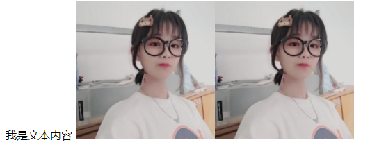

```html
<span>我是文本内容</span>

```

```css
img{
    width: 200px;
}
```

如果我们现在就要并排顶部对齐，那该怎么办呢？办法是：移民！脱离标准流！


### 脱离文档流

使⼀个元素脱离标准文档流有三种方式

1. 浮动
2. 绝对定位
3. 固定定位 


**实时效果反馈**

**1.下列哪种方式不能脱离文档流：**

<font style="background-color:rgb(233, 30, 100)">A</font>   浮动

<font style="background-color:rgb(255, 197, 10)">B</font>   绝对定位

<font style="background-color:#8bc34a">C</font>   固定定位

<font style="background-color:rgb(2, 170, 244);">D</font>   相对布局


**答案**

1=>D


## 浮动


### 浮动的定义

`float `属性定义元素在哪个方向浮动，任何元素都可以浮动。

| 值    | 描述         |
| ----- | ------------ |
| left  | 元素向左浮动 |
| right | 元素向右浮动 |


### 浮动的原理

1. 浮动以后使元素脱离了文档流
2. 浮动只有左右浮动，没有上下浮动


### 元素向左浮动

脱离文档流之后，元素相当于在页面上面增加一个浮层来放置内容。此时可以理解为有两层页面，一层是底层的原页面，一层是脱离文档流的上层页面，所以会出现折叠现象

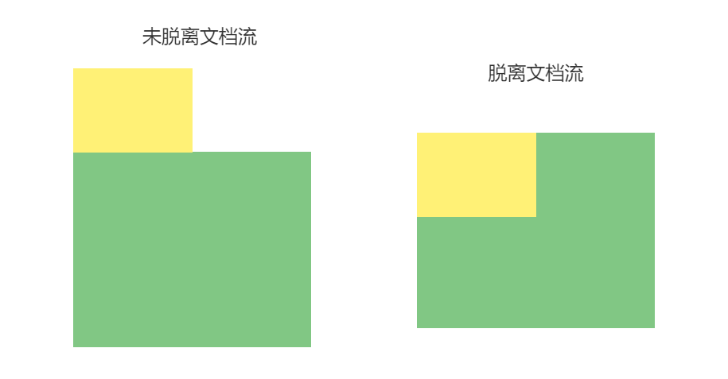


```html
<div class="box"></div>
<div class="container"></div>
```

```css
.container{
    width: 200px;
    height: 200px;
    background-color: #81c784;
}

.box{
    width: 100px;
    height: 100px;
    background-color: #fff176;
    float: left;
}
```


### 元素向右浮动

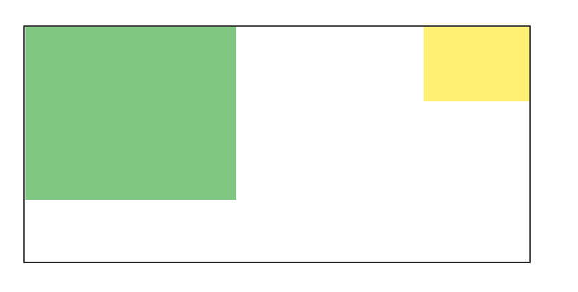


```html
<div class="box"></div>
<div class="container"></div>
```

```css
.container{
    width: 200px;
    height: 200px;
    background-color: #81c784;
}
.box{
    width: 100px;
    height: 100px;
    background-color: #fff176;
    float: right;
}
```


### 所有元素向左浮动

当所有元素同时浮动的时候，会变成水平摆放，向左或者向右


```html
<div class="box"></div>
<div class="box"></div>
<div class="box"></div>
```

```css
.box{
    width: 100px;
    height: 100px;
    background-color: #fff176;
    float: left;
    margin: 0 5px;
}
```


### 当容器不足时

当容器不足以横向摆放内容时候，会在下一行摆放

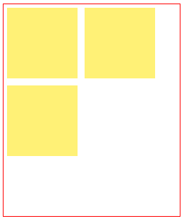

```html
<div class="container">
    <div class="box"></div>
    <div class="box"></div>
    <div class="box"></div>
</div>
```

```css
.container{
    width: 250px;
    height: 300px;
    border: 1px solid red;
}
.box{
    width: 100px;
    height: 100px;
    background-color: #fff176;
    float: left;
    margin: 5px;
}
```


**实时效果反馈**

**1.下列关于浮动描述错误的是：**

<font style="background-color:rgb(233, 30, 100)">A</font>   浮动以后使元素脱离了文档流

<font style="background-color:rgb(255, 197, 10)">B</font>   浮动只有左右浮动，没有上下浮动

<font style="background-color:#8bc34a">C</font>   `float `属性定义元素在哪个方向浮动，任何元素都可以浮动

<font style="background-color:rgb(2, 170, 244);">D</font>   当容器不足以横向摆放内容时候，会隐藏元素


**答案**

1=>D


## 清除浮动


### 浮动副作用

当元素设置float浮动后，该元素就会脱离文档流并向左/向右浮动，

1. 浮动元素会造成父元素高度塌陷
2. 后续元素会受到影响


```css
<div class="container">
    <div class="box"></div>
    <div class="box"></div>
    <div class="box"></div>
</div>
```

```css
.container{
    border: 1px solid red;
}
.box{
    width: 100px;
    height: 100px;
    background-color: #fff176;
    float: left;
    margin: 5px;
}
```


```html
<div class="box"></div>
<div class="box"></div>
<div class="box"></div>
<div class="nav"></div>
```

```css
.box{
    width: 100px;
    height: 100px;
    background-color: #fff176;
    float: left;
    margin: 5px;
}
.nav{
    width: 100px;
    height: 100px;
    background-color: red;
}
```


### 清除浮动

当父元素出现塌陷的时候，对布局是不利的，所以我们必须清除副作用

解决方案有很多种

1. 父元素设置高度
2. 受影响的元素增加clear属性
3. overflow清除浮动
4. 伪对象方式


#### 父元素设置高度

如果父元素高度塌陷，可以给父元素设置高度，撑开元素本身大小


```html
<div class="container">
    <div class="box"></div>
    <div class="box"></div>
    <div class="box"></div>
</div>
```

```css
.container{
    height: 300px;
    width: 350px;
    border: 1px solid red;
}
.box{
    width: 100px;
    height: 100px;
    background-color: #fff176;
    float: left;
    margin: 5px;
}
```


#### overflow清除浮动

如果有父级塌陷，并且同级元素也收到了影响，可以使用`overflow`清除浮动

这种情况下，父布局不能设置高度

父级标签的样式里面加: `overflow:hidden;clear: both;`

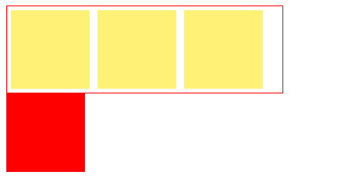

```html
<div class="container">
    <div class="box"></div>
    <div class="box"></div>
    <div class="box"></div>
</div>
<div class="nav"></div>
```

```css
.container{
    width: 350px;
    border: 1px solid red;
    overflow: hidden;
    clear: both;
}
.box{
    width: 100px;
    height: 100px;
    background-color: #fff176;
    float: left;
    margin: 5px;
}
.nav{
    width: 100px;
    height: 100px;
    background-color: red;
}
```


#### 伪对象方式

如果有父级塌陷，并且同级元素也收到了影响，还可以使用伪对象方式处理

为父标签添加伪类`after`,设置空的内容，并且使用`clear:both`;

这种情况下，父布局不能设置高度

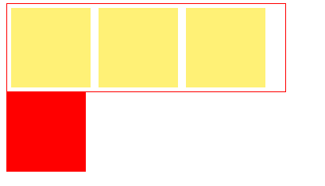

```html
<div class="container">
    <div class="box"></div>
    <div class="box"></div>
    <div class="box"></div>
</div>
<div class="nav"></div>
```

```css
.container {
    width: 350px;
    border: 1px solid red;
}
.container::after {
    content: "";
    display: block;
    clear: both;
}
.box {
    width: 100px;
    height: 100px;
    background-color: #fff176;
    float: left;
    margin: 5px;
}
.nav {
    width: 100px;
    height: 100px;
    background-color: red;
}
```


**实时效果反馈**

**1.下列关于清除浮动的方法，描述错误的是：**

<font style="background-color:rgb(233, 30, 100)">A</font>   如果父元素塌陷，可以设置父元素高度消除浮动的副作用

<font style="background-color:rgb(255, 197, 10)">B</font>   如果后续元素受到浮动影响，可以使用`clear: both;`清除

<font style="background-color:#8bc34a">C</font>   如果父元素塌陷，可以使用伪对象方式清除

<font style="background-color:rgb(2, 170, 244);">D</font>   如果父元素塌陷同时影响后续元素，可以使用`float`清除


**答案**

1=>D


## 定位


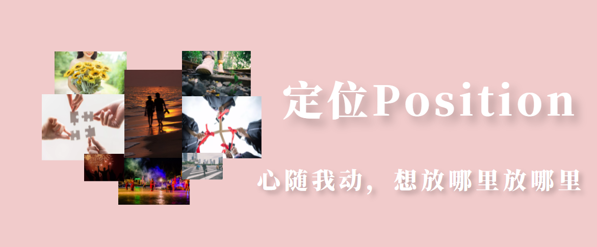


### 定义

`position `属性指定了元素的定位类型

| 值       | 描述     |
| -------- | -------- |
| relative | 相对定位 |
| absolute | 绝对定位 |
| fixed    | 固定定位 |

其中，绝对定位和固定定位会脱离文档流

设置定位之后：可以使用四个方向值进行调整位置：`left、top、right、bottom` 


### 相对定位

```html
<div class="box"></div>
```

```css
.box{
    width: 200px;
    height: 200px;
    background-color: red;
    position: relative;
    left: 100px;
}
```


### 绝对定位

```html
<div class="box1"></div>
<div class="box2"></div>
```

```css
.box1{
    width: 200px;
    height: 200px;
    background-color: red;
    position:absolute;
    left: 50px;
}
.box2{
    width: 300px;
    height: 300px;
    background-color: green;
}
```


### 固定定位

```html
<div class="box1"></div>
<div class="box2"></div>
```

```css
.box1{
    width: 200px;
    height: 200px;
    background-color: red;
    position:fixed;
    left: 50px;
}
.box2{
    width: 300px;
    height: 300px;
    background-color: green;
}
```


> **温馨提示**
>
> 设置定位之后，相对定位和绝对定位他是相对于具有定位的父级元素进行位置调整，如果父级元素不存在定位，则继续向上逐级寻找，直到顶层文档


```html
<div class="container">
    <div class="box"></div>
</div>
```

```css
.container{
    width: 300px;
    height: 300px;
    background-color: #666;
    position: relative;
    left: 200px;
}
.box{
    width: 200px;
    height: 200px;
    background-color: red;
    position:absolute;
}
```


### Z-index

`z-index`属性设置元素的堆叠顺序。拥有更高堆叠顺序的元素总是会处于堆叠顺序较低的元素的前面

```html
<div class="box1"></div>
<div class="box2"></div>
```

```css
.box1{
    width: 200px;
    height: 200px;
    background-color: red;
    position:absolute;
    z-index: 2;
}
.box2{
    width: 300px;
    height: 300px;
    background-color: green;
    position:absolute;
    z-index: 1;
}
```


**实时效果反馈**

**1.下列哪种属性设置不会脱离文档流：**

<font style="background-color:rgb(233, 30, 100)">A</font>   相对定位

<font style="background-color:rgb(255, 197, 10)">B</font>   绝对定位

<font style="background-color:#8bc34a">C</font>   固定定位

<font style="background-color:rgb(2, 170, 244);">D</font>   浮动


**答案**

1=>A


## CSS3新特性


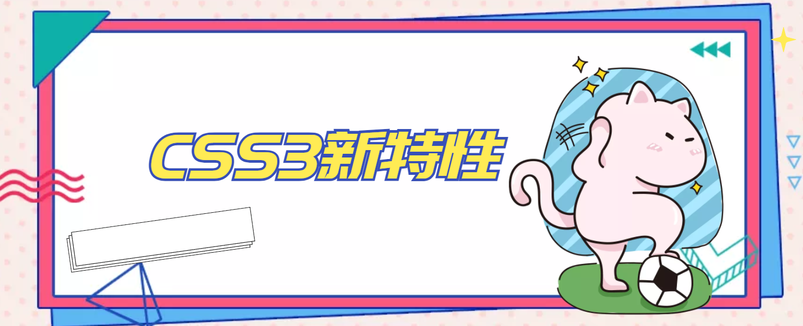


### 圆角


使用 CSS3 `border-radius` 属性，你可以给任何元素制作 "圆角"

`border-radius` 属性，可以使用以下规则：

1. 四个值: 第一个值为左上角，第二个值为右上角，第三个值为右下角，第四个值为左下角
2. 三个值: 第一个值为左上角, 第二个值为右上角和左下角，第三个值为右下角
3. 两个值: 第一个值为左上角与右下角，第二个值为右上角与左下角
4. 一个值： 四个圆角值相同


```html
<div class="box1"></div>
<div class="box2"></div>
<div class="box3"></div>
```

```css
div{
    margin: 10px;
}
.box1 {
    border-radius: 15px 50px 30px 5px;
    background: #8AC007;
    padding: 20px;
    width: 200px;
    height: 150px;
}
.box2 {
    border-radius: 15px 50px 30px;
    background: #8AC007;
    padding: 20px;
    width: 200px;
    height: 150px;
}
.box3 {
    border-radius: 15px 50px;
    background: #8AC007;
    padding: 20px;
    width: 200px;
    height: 150px;
}
```


### 阴影


box-shadow 向框添加一个或多个阴影。

```css
box-shadow: h-shadow v-shadow blur color;
```

| 值       | 描述                 |
| -------- | -------------------- |
| h-shadow | 必选，水平阴影的位置 |
| v-shadow | 必选，垂直阴影的位置 |
| blur     | 可选，模糊距离       |
| color    | 可选，阴影的颜色     |


```html
<div class="box"></div>
```

```css
.box {
    width: 200px;
    height: 200px;
    background-color: #8ac007;
    margin: 50px;
    box-shadow: 10px 10px green;
}
```


给阴影添加一个模糊效果

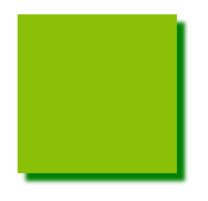

```css
.box {
    width: 200px;
    height: 200px;
    background-color: #8ac007;
    margin: 50px;
    box-shadow: 10px 10px 5px green;
}
```


三个方向的阴影效果

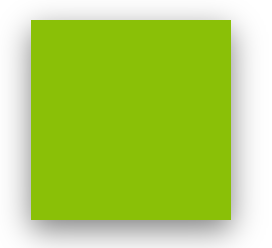

```css
.box {
    width: 200px;
    height: 200px;
    background-color: #8ac007;
    margin: 50px;
    box-shadow: 0 10px 30px rgba(0,0,0,.5);
}
```


**实时效果反馈**

**1.将一个正方形盒子改成圆形，下列哪个设置可以实现：**

<font style="background-color:rgb(233, 30, 100)">A</font>   `{border:50%;}`

<font style="background-color:rgb(255, 197, 10)">B</font>   `{border-radius:50%;}`

<font style="background-color:#8bc34a">C</font>   `{border-radius:50px;}`

<font style="background-color:rgb(2, 170, 244);">D</font>   `{border:50px;}`


**2.完成一个水平垂直阴影位置为0，模糊度为10px，颜色为黑色半透明：**

<font style="background-color:rgb(233, 30, 100)">A</font>   `box-shadow: 0px 0px 10px rgba(0,0,0,0.5);`

<font style="background-color:rgb(255, 197, 10)">B</font>   `box-shadow: 0px 0px  rgba(0,0,0,0.5);`

<font style="background-color:#8bc34a">C</font>   `box-shadow:  0px 10px 10px #000;`

<font style="background-color:rgb(2, 170, 244);">D</font>   `box-shadow: 10px 10px 0px rgba(0,0,0,0.5);`


**答案**

1=>B   2=>A


## 动画


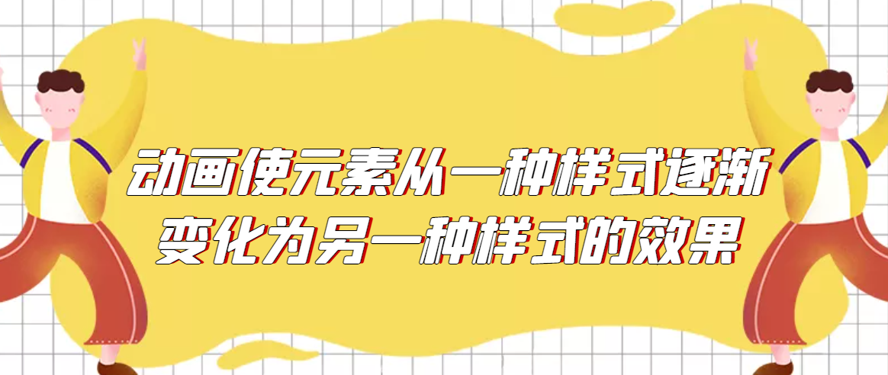


动画是使元素从一种样式逐渐变化为另一种样式的效果

您可以改变任意多的样式任意多的次数

请用百分比来规定变化发生的时间，或用关键词 "from" 和 "to"，等同于 0% 和 100%

0% 是动画的开始，100% 是动画的完成。


### @keyframes创建动画

使用`@keyframes`规则，你可以创建动画

```css
@keyframes name {
    from|0%{
    	css样式
    }
    percent{
    	css样式
    }
    to|100%{
    	css样式
    }
}
```

name：动画名称，开发人员自己命名；

percent：为百分比值，可以添加多个百分比值；


### animation执行动画

```css
animation: name duration timing-function delay iteration-count direction;
```

| 值                   | 描述                                                      |
| -------------------- | --------------------------------------------------------- |
| name                 | 设置动画的名称                                            |
| duration             | 设置动画的持续时间                                        |
| timing-function      | 设置动画效果的速率（如下）                                |
| delay                | 设置动画的开始时间（延时执行）                            |
| iteration-count      | 设置动画循环的次数，infinite为无限次数的循环              |
| direction            | 设置动画播放的方向（如下）                                |
| animation-play-state | 控制动画的播放状态：running代表播放，而paused代表停止播放 |

| timing-function值 | 描述             |
| ----------------- | ---------------- |
| ease              | 逐渐变慢（默认） |
| linear            | 匀速             |
| ease-in           | 加速             |
| ease-out          | 减速             |
| ease-in-out       | 先加速后减速     |

| direction值 | 描述                                             |
| ----------- | ------------------------------------------------ |
| normal      | 默认值为normal表示向前播放                       |
| alternate   | 动画播放在第偶数次向前播放，第奇数次向反方向播放 |


**切换背景颜色**

```html
<div class="animation"></div>
```

```css
.animation {
    width: 300px;
    height: 300px;
    background-color: red;
    animation: anima 5s linear 5s infinite;
}
.animation:hover {
    animation-play-state: paused;
}
@keyframes anima {
    0% {
        background-color: red;
    }
    50% {
        background-color: green;
    }
    100% {
        background-color: blueviolet;
    }
}
```


**呼吸效果**

```html
<div class="box"></div>
```

```css
.box {
    width: 500px;
    height: 400px;
    margin: 40px auto;
    background-color: #2b92d4;
    border-radius: 5px;
    box-shadow: 0 1px 2px rgba(0, 0, 0, .3);
    animation: breathe 2700ms ease-in-out infinite alternate;
}
@keyframes breathe {
    0% {
        opacity: .2;
        box-shadow: 0 1px 2px rgba(255, 255, 255, 0.1)
    }
    50% {
        opacity: .5;
        box-shadow: 0 1px 2px rgba(18, 190, 84, 0.76)
    }
    100% {
        opacity: 1;
        box-shadow: 0 1px 30px rgba(59, 255, 255, 1)
    }
}
```


**实时效果反馈**

**1.动画属性中，`iteration-count: infinite `属性的作用是：**

<font style="background-color:rgb(233, 30, 100)">A</font>   设置动画效果时间

<font style="background-color:rgb(255, 197, 10)">B</font>   设置动画效果速率

<font style="background-color:#8bc34a">C</font>   设置动画的开始时间

<font style="background-color:rgb(2, 170, 244);">D</font>   设置动画无限循环


**答案**

1=>D


## 媒体查询


媒体查询能使页面在不同在终端设备下达到不同的效果

媒体查询会根据设备的大小自动识别加载不同的样式


### 设置meta标签

使用设备的宽度作为视图宽度并禁止初始的缩放。在`<head>`标签里加入这个meta标签。 

```css
<meta name="viewport" content="width=device-width, initial-scale=1,maximum-scale=1, user-scalable=no">
```


**参数解释**

1. `width = device-width` 宽度等于当前设备的宽度
2. `initial-scale` 初始的缩放比例（默认设置为1.0）
3. `maximum-scale` 允许用户缩放到的最大比例（默认设置为1.0）
4. `user-scalable` 用户是否可以手动缩放（默认设置为no）


### 媒体查询语法

```css
@media screen and (max-width: 768px) {
	/* 设备小于768px加载样式 */
    body{
        background-color: red;
    }
}
@media screen and (max-width: 992px) and (min-width: 768px) {
     /* 设备小于768px但小于992px加载样式  */
     body{
     	background-color: pink;
     }
}
@media screen and (min-width: 992px) {
	/* 设备大于992px加载样式 */
    body{
    	background-color: green;
   	}
}
```


**实时效果反馈**

**1.下列代码媒体查询，运行在屏幕宽度为800px的设备上，背景颜色是：**

```css
@media screen and (max-width: 768px) {
    body{
        background-color: red;
    }
}
@media screen and (max-width: 992px) and (min-width: 768px) {
     body{
     	background-color: pink;
     }
}
@media screen and (min-width: 992px) {
    body{
    	background-color: green;
   	}
}
```

<font style="background-color:rgb(233, 30, 100)">A</font>   red(红色)

<font style="background-color:rgb(255, 197, 10)">B</font>   pink(粉色)

<font style="background-color:#8bc34a">C</font>   green(绿色)

<font style="background-color:rgb(2, 170, 244);">D</font>   black(黑色)


**答案**

1=>B


## 雪碧图


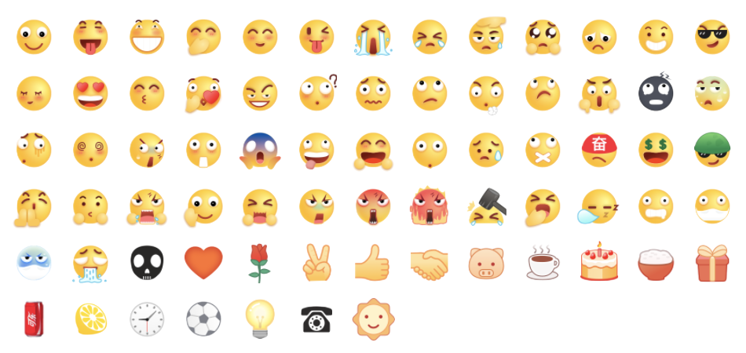


CSS Sprite也叫CSS精灵图、CSS雪碧图，是一种网页图片应用处理方式。它允许你将一个页面涉及到的所有零星图片都包含到一张大图中去


### 优点

1. 减少图片的字节
2. 减少网页的http请求，从而大大的提高页面的性能


### 原理

1. 通过background-image引入背景图片
2. 通过background-position把背景图片移动到自己需要的位置


### 实例

```html
<i class="icon1"></i>
<i class="icon2"></i>
```

```css
.icon1 {
    display: block;
    background-image: url(1.png);
    background-position: -20px 0;
    width: 45px;
    height: 70px;
}
.icon2 {
    display: block;
    background-image: url(1.png);
    background-position: -93px -84px;
    width: 45px;
    height: 70px;
}
```


## 字体图标


我们会经常用到一些图标。但是我们在使用这些图标时，往往会遇到失真的情况，而且图片数量很多的话，页面加载就越慢。所以，我们可以使用字体图标的方式来显示图标，既解决了失真的问题，也解决了图片占用资源的问题

常用字体图标库：[阿里字体图标库](https://iconfont.cn/)


### 优点

1. 轻量性：加载速度快，减少http请求
2. 灵活性：可以利用CSS设置大小颜色等
3. 兼容性：网页字体支持所有现代浏览器，包括IE低版本


### 使用字体图标

1. 注册账号并登录
2. 选取图标或搜索图标
3. 添加购物车
4. 下载代码
5. 选择`font-class`引用


```html
<span class="iconfont icon-add-circle"></span>
```

```css
<link rel="stylesheet" href="./css/iconfont.css">
.iconfont{
    font-size: 35px;
    color: red;
}
```


